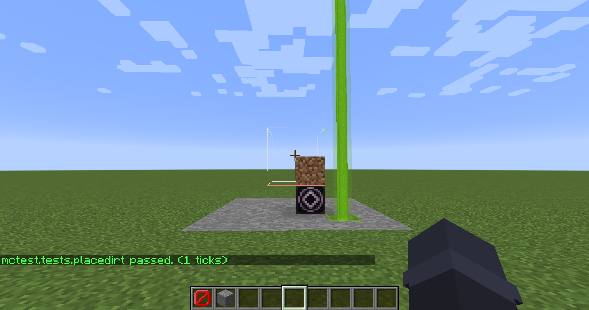

# Game Tests backport for 1.12.2

This framework is in the alpha stage.
There are a lot of missing features compared to the 1.17+ Game Tests.

## How to use

Add this mod to dependencies:
```groovy
dependencies {
    implementation("com.bqc0n:mctest:0.0.2")
}
```

and write some tests:

```java
@GameTestHolder("mctest")
public class Tests {
    @GameTest
    public void placeDirt(GameTestHelper helper) {
        BlockPos pos = BlockPos.ORIGIN.up();
        helper.setBlock(pos, Blocks.DIRT);
        helper.succeedWhenBlockPresent(Blocks.DIRT.getDefaultState(), pos);
    }
}
```

Note that the `GameTestHolder` annotation is required.

then run the tests using the `mctest runall` command:



### Test names and structure names

Test name will be `<namespace>:<class name>.<method name>` in lowercase, so in the example above it will be `mctest:tests.placedirt`.

Structure name is a bit more complicated, it will be 

1. `<namespace>:<class name>_<method name>` if no `template` specified in `@GameTest` annotation.
2. `<namespace>:<class name>_<template>` if `template` is specified in `@GameTest` annotation, but no `:` in it.
3. `<template>` if `template` is specified in `@GameTest` annotation and it contains `:`.

All above is in lowercase. So in the example above it will be `mctest:tests_placedirt`.
Underscores are used instead of dots because we can't use dots in 1.12.2 structure names.